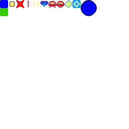

### tools for extracting resources from png files

#### editing game resources
* edit gimp files "sprites.xcf" and "tiles.xcf"
* suggestion is to create a layer for each sprite / tile
* "sprites.xcf" and "tiles.xcf" can use different palettes
* "sprites.xcf" background color is index 0 and represents transparent pixel

#### exporting to png for extraction
* enable all layers

* File -> Export As...

#### extracting resources
script `./extract-to-resources.sh` will overwrite `game/resources/*` files

note. make sure transparency pixel is palette index 0

### current resources
tiles:

sprites:

